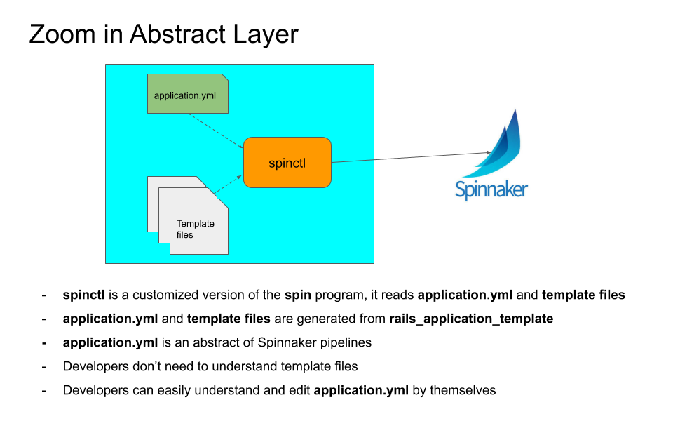
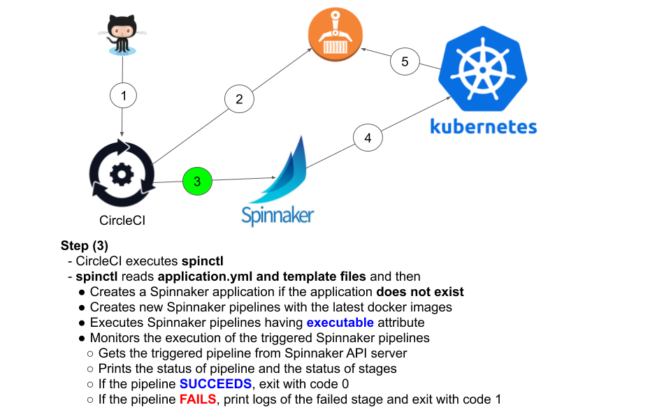

# An extension of Spinnaker CLI

<p align="center">
  
</p>
<p align="center">
  
</p>
<p align="center">
  
</p>
<p align="center">
  
</p>
<p align="center">
  
</p>
<p align="center">
  
</p>
<p align="center">
  
</p>

## Demo
### application.yml and template files
https://github.com/ngocson2vn/spinctl/tree/master/example/spinnaker

### CircleCI config
```yaml
  deploy-eks:
    machine:
      enabled: true
      docker_layer_caching: true
    working_directory: ~/sample
    steps:
      - checkout
      - run: *setenv
      - run:
          name: Deploy app to EKS
          command: |
            latest=$(curl -s https://api.github.com/repos/ngocson2vn/spinctl/releases/latest | jq -r .tag_name)
            wget https://github.com/ngocson2vn/spinctl/releases/download/$latest/spinctl -O /home/circleci/bin/spinctl
            chmod 755 /home/circleci/bin/spinctl
            aws s3 cp s3://${SECURE_BUCKET}/common/${DEPLOY_STAGE}/spin/config ~/.spin/config
            /home/circleci/bin/spinctl application deploy --file .spinnaker/application.yml --image $NGINX_IMAGE_NAME --image $IMAGE_NAME
```
### SUCCEEDED case
<p align="center">
  
</p>
<p align="center">
  
</p>

### FAILED case
<p align="center">
  
</p>
<p align="center">
  
</p>


# Installation & Configuration

Follow the instructions at [spinnaker.io](https://www.spinnaker.io/guides/spin/cli/#install-and-configure-spin-cli).


# Development

## GOPATH (< 1.12)

Fetch the code

```bash
$ go get github.com/ngocson2vn/spinctl
```

**Note**: If you are using two-factor authentication with ssh keys to authenticate with GitHub,
you may need to run the following git command:

```bash
$ git config --global --add url."git@github.com:".insteadOf "https://github.com/"
```

for the `go get` command to work properly.

Enter the code's directory

```bash
$ cd $GOPATH/src/github.com/ngocson2vn/spinctl
```

Fetch dependencies and build with with

```bash
$ go get -d -v -u
$ go build -v
```

from the root `spin/` directory.


## Go modules (>= 1.12)

Clone the repository to a directory outside of your GOPATH:

```bash
$ git clone https://github.com/ngocson2vn/spinctl
```

Afterward, use `go build` to build the program. This will automatically fetch dependencies.

```bash
$ go build
```

Upon first build, you may see output while the `go` tool fetches dependencies.

To verify dependencies match checksums under go.sum, run `go mod verify`.

To clean up any old, unused go.mod or go.sum lines, run `go mod tidy`.


## Running the program

Run using

```bash
./spin <cmds> <flags>
```


## Running tests

Test using

```bash
go test -v ./...
```

from the root `spin/` directory.
